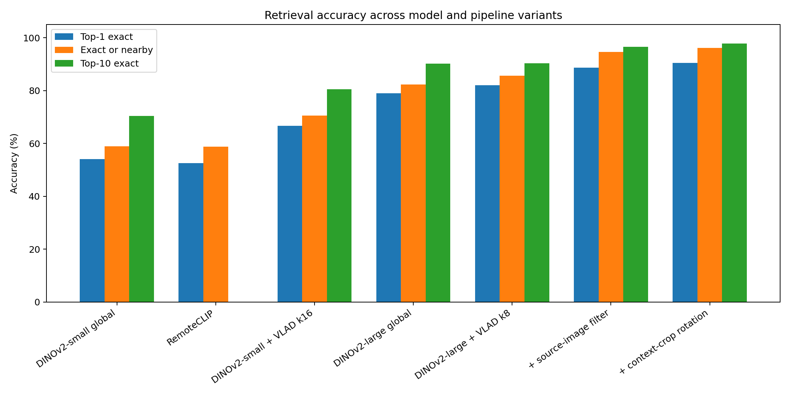
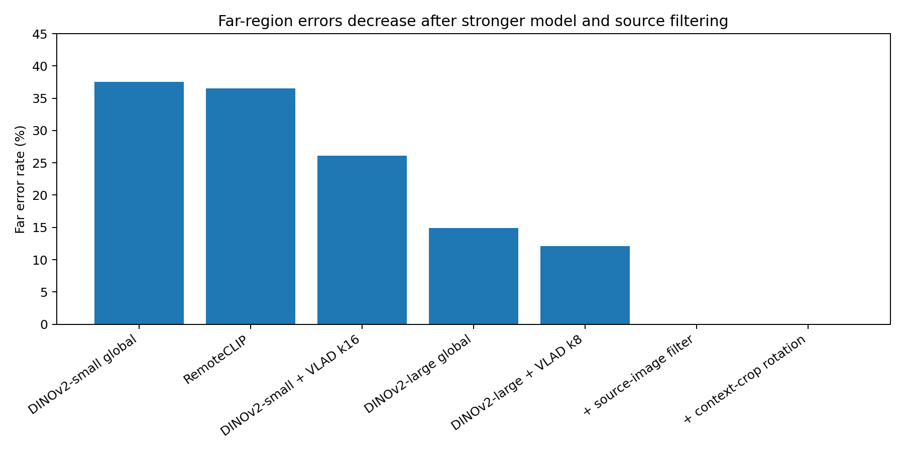
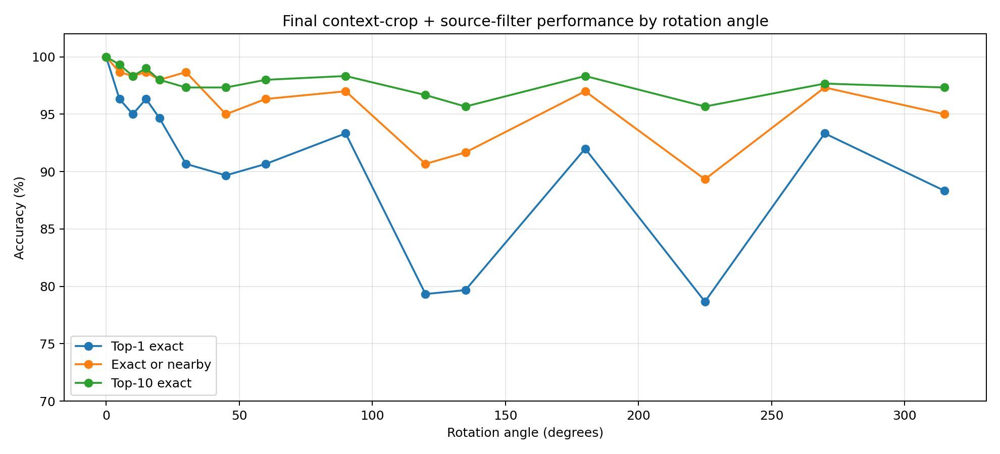
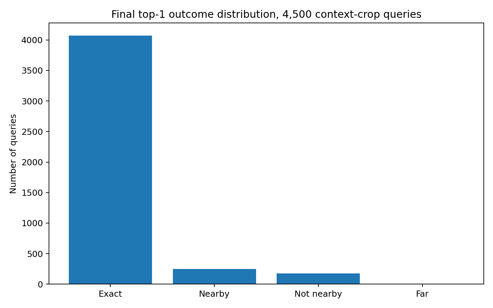
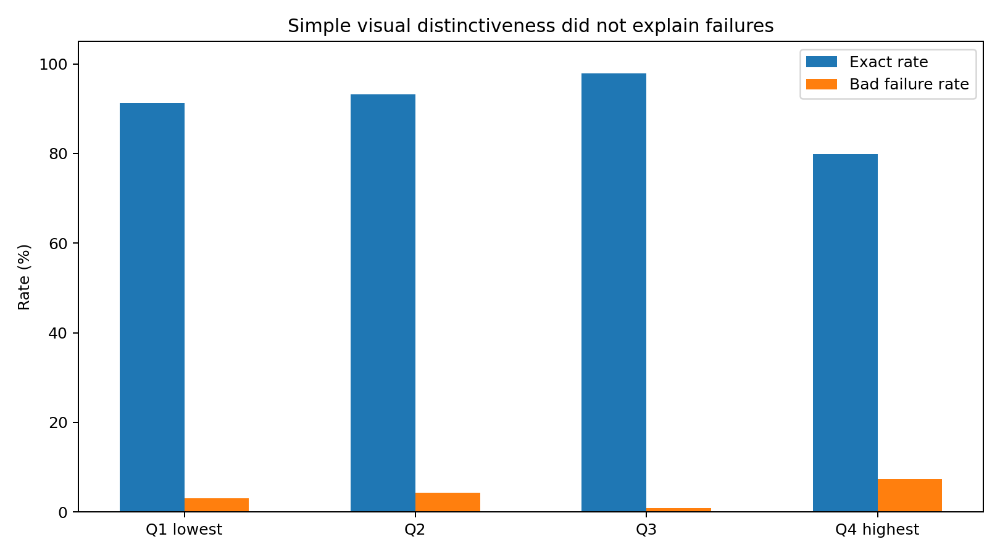

# Drone Visual Localization Report

**Goal:** match a drone/query image to the correct satellite tile using vector search.  
**Current best system:** DINOv2-large patch features + VLAD k=8 + Endee search + approximate GPS/source-image filtering.  
**Dataset setup:** Bellingham satellite imagery, split into 500×500 tiles.

---

## 1. Executive Summary

We built a satellite-image retrieval pipeline for drone localization. Large satellite images were split into 500×500 tiles, converted into vectors, stored in Endee, and searched using query-image vectors.

The strongest final setup is:

```text
DINOv2-large patch features
+ VLAD k=8 aggregation
+ Endee vector search
+ source_image metadata filter as approximate GPS
+ context-crop rotation query generation
```

Final best result on **4,500 rotated context-crop queries**:

| Metric | Result |
|---|---:|
| Top-1 exact | **90.53%** |
| Top-1 exact or nearby | **96.11%** |
| Top-5 exact | **96.40%** |
| Top-10 exact | **97.80%** |
| Far error rate | **0.00%** |

The key finding is that most remaining errors are not global location mistakes anymore. After filtering, the system almost always searches the correct source region; the remaining failures are local ambiguities inside that region.

---

## 2. Data Preparation

The original satellite images are approximately 5000×5000 pixels. We first tried 512×512 tiles, but 5000 is not divisible by 512, so edge pixels were left uncovered.

We switched to:

```text
tile_size = 500
stride = 500
```

This gives:

```text
5000 / 500 = 10 tiles per side
10 × 10 = 100 tiles per image
36 images × 100 tiles = 3600 database tiles
```

Each tile stores metadata:

```text
tile_id, source_image, city, x, y, tile_size, stride, source_width, source_height, path
```

Example:

```text
bellingham10_x2500_y2000
```

means the tile starts at pixel `(2500, 2000)` in `bellingham10.tif`.

---

## 3. Evaluation Setup

For each query image, Endee returns top-k candidate tiles. The top-1 result is classified as:

| Category | Meaning |
|---|---|
| Exact | Retrieved tile is the correct tile |
| Nearby | Retrieved tile is spatially close to the correct tile |
| Not nearby | Retrieved tile is from the same source image but far from the target |
| Far | Retrieved tile is from another source image |

For rotation testing, we used 15 angles:

```text
0, 5, 10, 15, 20, 30, 45, 60, 90, 120, 135, 180, 225, 270, 315
```

with 300 queries per angle, giving 4,500 total queries.

---

## 4. Model Experiments



| Setup | Top-1 Exact | Exact/Nearby | Top-10 Exact | Far Rate | Decision |
|---|---:|---:|---:|---:|---|
| DINOv2-small global | 54.11% | 58.93% | 70.44% | 37.56% | Discarded: too weak |
| RemoteCLIP | 52.60% | 58.82% | — | 36.56% | Discarded: weak for arbitrary rotation |
| DINOv2-small + VLAD k16 | 66.71% | 70.53% | 80.51% | 26.13% | Better, but still not enough |
| DINOv2-large global | 78.96% | 82.33% | 90.20% | 14.87% | Strong baseline |
| DINOv2-large + VLAD k8 | 82.00% | 85.71% | 90.40% | 12.09% | Best unfiltered model |
| + source-image filter | 88.64% | 94.64% | 96.56% | 0.00% | Strong practical setup |
| + context-crop rotation | **90.53%** | **96.11%** | **97.80%** | **0.00%** | Current best |

### Why DINOv2-large + VLAD worked best

Global embeddings compress the whole image into one vector. Rotation changes the layout, so the global vector can shift. VLAD instead aggregates many local DINOv2 patch features, making the vector more robust to layout changes.

The best vector configuration was:

```text
DINOv2-large patch dimension = 1024
VLAD clusters = 8
Final vector dimension = 8192
```

---

## 5. Why Other Approaches Were Discarded

**DINOv2-small global:** too weak under rotation, with only 54.11% top-1 exact and 37.56% far errors.

**RemoteCLIP:** remote-sensing oriented, but it performed poorly for arbitrary rotations and did not beat DINOv2-large.

**DINOv2-small + VLAD k16:** confirmed that VLAD helps, but the small backbone was not strong enough.

**Distance metric switching:** cosine, L2, and dot product were approximately the same because vectors were normalized.

**Query-time rotation ensemble:** failed on 135° queries because already-rotated synthetic images were rotated again, causing double interpolation artifacts and rotated black masks. It was also too slow on CPU.

---

## 6. Approximate GPS / Metadata Filtering



We simulated approximate GPS by filtering on `source_image`.

Instead of searching all 3,600 tiles:

```text
query vector → all Bellingham tiles
```

we searched only the known source region:

```python
filter=[{"source_image": {"$eq": source_image}}]
```

Effect:

| Setup | Top-1 Exact | Exact/Nearby | Top-10 Exact | Far Rate |
|---|---:|---:|---:|---:|
| DINOv2-large + VLAD k8, unfiltered | 82.00% | 85.71% | 90.40% | 12.09% |
| + source-image filter | **88.64%** | **94.64%** | **96.56%** | **0.00%** |

Approximate GPS removed all far-region errors.

---

## 7. Correcting Rotation Query Generation

The first rotation-query method rotated a 500×500 tile inside the same 500×500 box, which created artificial black corners. A drone image would not have these black corners.

We fixed this using context-crop rotation:

```text
original 5000×5000 source image
→ crop 800×800 around tile center
→ rotate 800×800 crop
→ center-crop 500×500
```

Final comparison:

| Setup | Top-1 Exact | Exact/Nearby | Top-10 Exact | Far Rate |
|---|---:|---:|---:|---:|
| Black-corner rotation + source filter | 88.64% | 94.64% | 96.56% | 0.00% |
| **Context-crop rotation + source filter** | **90.53%** | **96.11%** | **97.80%** | **0.00%** |

---

## 8. Final Angle-wise Performance



| Rotation | Top-1 Exact | Exact/Nearby | Top-10 Exact |
|---:|---:|---:|---:|
| 0° | 100.00% | 100.00% | 100.00% |
| 5° | 96.33% | 98.67% | 99.33% |
| 10° | 95.00% | 98.33% | 98.33% |
| 15° | 96.33% | 98.67% | 99.00% |
| 20° | 94.67% | 98.00% | 98.00% |
| 30° | 90.67% | 98.67% | 97.33% |
| 45° | 89.67% | 95.00% | 97.33% |
| 60° | 90.67% | 96.33% | 98.00% |
| 90° | 93.33% | 97.00% | 98.33% |
| 120° | 79.33% | 90.67% | 96.67% |
| 135° | 79.67% | 91.67% | 95.67% |
| 180° | 92.00% | 97.00% | 98.33% |
| 225° | 78.67% | 89.33% | 95.67% |
| 270° | 93.33% | 97.33% | 97.67% |
| 315° | 88.33% | 95.00% | 97.33% |
| **ALL** | **90.53%** | **96.11%** | **97.80%** |

Hardest angles remain `120°`, `135°`, and `225°`. However, even at those angles, top-10 exact remains high, so reranking could help.

---

## 9. Final Error Distribution



| Category | Count | Rate |
|---|---:|---:|
| Exact | 4074 | 90.53% |
| Nearby | 251 | 5.58% |
| Not nearby | 175 | 3.89% |
| Far | 0 | 0.00% |

This confirms that the remaining errors are local confusions within the correct source image.

---

## 10. Distinctiveness Analysis

We tested whether failures were caused by visually plain tiles such as water, trees, or forests. A simple visual distinctiveness score used entropy, edge density, gradient strength, color variation, green dominance, and blue dominance.

Removing the bottom 25% of tiles did not improve accuracy.

| Setup | Queries | Top-1 Exact | Exact/Nearby | Top-10 Exact |
|---|---:|---:|---:|---:|
| All context queries | 4500 | **90.53%** | **96.11%** | **97.80%** |
| Distinct-only, bottom 25% removed | 3375 | 90.31% | 95.82% | 97.36% |



| Distinctiveness Quartile | Exact Rate | Acceptable Rate | Bad Failure Rate |
|---|---:|---:|---:|
| Q1 lowest | 91.20% | 96.98% | 3.02% |
| Q2 | 93.24% | 95.64% | 4.36% |
| Q3 | **97.87%** | **99.11%** | **0.89%** |
| Q4 highest | 79.82% | 92.71% | 7.29% |

Conclusion:

```text
The remaining failures are not mainly caused by plain lakes/trees/forest tiles.
They are more likely caused by high-texture but repetitive or ambiguous urban regions.
```

---

## 11. Main Conclusions

1. **DINOv2-large is much stronger than DINOv2-small** for this task.
2. **RemoteCLIP did not help**, despite being remote-sensing oriented.
3. **VLAD aggregation improved rotation robustness** over a single global embedding.
4. **Approximate GPS/source filtering is highly effective**, reducing far errors to zero.
5. **Context-crop rotation is more realistic** than black-corner rotation.
6. **Remaining errors are local ambiguities**, not global retrieval failures.
7. **Simple visual distinctiveness is not enough** to identify failure-prone tiles.

---

## 12. Recommended Next Steps

### 1. Ambiguity-based difficulty analysis

Classify tiles by actual retrieval behavior:

```text
easy: high exact rate, no bad failures
medium: mostly exact/nearby
hard: repeated wrong local matches
very hard: high bad-failure rate
```

### 2. Tighter approximate GPS filtering

Current filter uses only:

```text
source_image = bellinghamN.tif
```

A more realistic GPS filter could also use approximate x/y range:

```text
source_image = bellinghamN.tif
x within ±1000 px
y within ±1000 px
```

### 3. Top-k reranking

Since final top-10 exact is 97.80%, a reranker could convert many top-10 successes into top-1 successes.

Possible reranking methods:

```text
local feature matching
geometric verification
rotation-aware comparison
small candidate-set image alignment
```

### 4. Real drone imagery testing

Current evaluation uses synthetic satellite-derived queries. Real drone images may introduce viewpoint change, motion blur, lighting differences, altitude differences, seasonal changes, and occlusions.

---

## 13. Short Presentation Summary

We built a vector-search pipeline for drone visual localization using satellite image tiles. The images were split into clean 500×500 tiles and stored in Endee after vectorization. We tested DINOv2-small, DINOv2-large, RemoteCLIP, and AnyLoc-style DINOv2 + VLAD variants.

The best model was DINOv2-large patch features with VLAD k=8. Without filtering it achieved 82.00% top-1 exact accuracy. Adding approximate GPS through source-image filtering improved this to 88.64% and removed far errors completely. After replacing artificial black-corner rotations with realistic context-crop rotations, the final result reached 90.53% top-1 exact, 96.11% exact-or-nearby, and 97.80% top-10 exact.

The remaining failures are mainly local ambiguities inside the correct source region, especially at hard rotations like 120°, 135°, and 225°. The next improvements should focus on tighter GPS filtering, ambiguity-based analysis, and top-k reranking.

---
## References

- DINOv2: Learning Robust Visual Features without Supervision — https://arxiv.org/abs/2304.07193

- AnyLoc: Towards Universal Visual Place Recognition — https://arxiv.org/abs/2308.00688

- AnyLoc GitHub repository — https://github.com/AnyLoc/AnyLoc

- RemoteCLIP: A Vision Language Foundation Model for Remote Sensing — https://arxiv.org/abs/2306.11029

- Inria Aerial Image Labeling Dataset / Benchmark — https://project.inria.fr/aerialimagelabeling/

- Inria Aerial Image Labeling Benchmark paper: Can Semantic Labeling Methods Generalize to Any City? — https://inria.hal.science/hal-01468452/document

- Endee Vector Database — https://github.com/Endee-Pro/navigation
